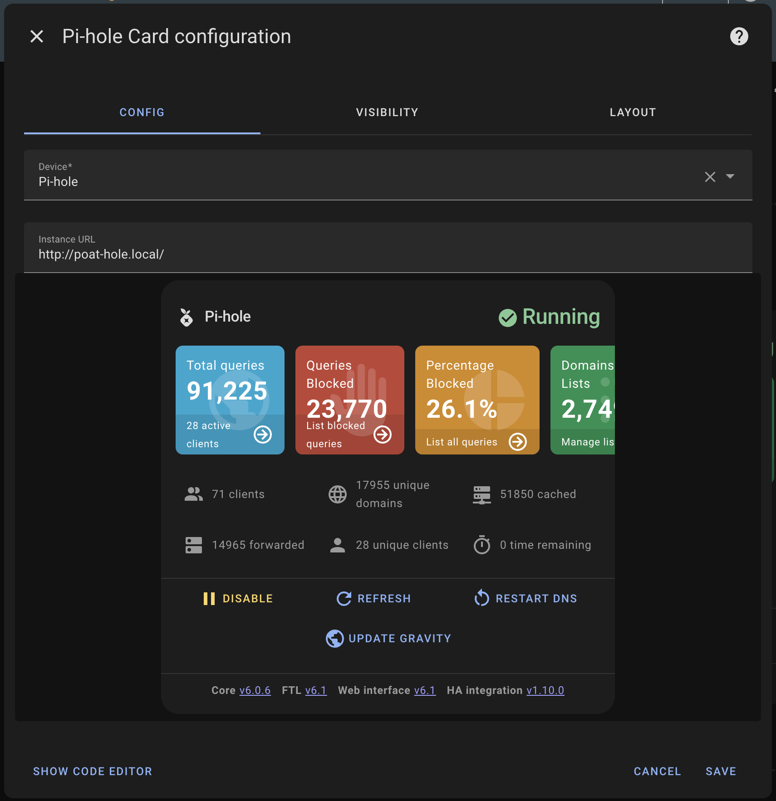

# Configuration Guide

This guide covers all configuration options for the Pi-hole Card, from basic setup to advanced customization.

## Table of Contents

- [Basic Configuration](#basic-configuration)
- [Finding your `device_id`](#finding-your-device_id)
- [Configuration Options](configuration/OPTIONS.md)
- [Action Configuration](configuration/ACTIONS.md)
- [Sections, filtering, and ordering](configuration/SECTIONS.md)
- [Pause configuration](configuration/PAUSE.md)
- [Chart configuration](configuration/CHART.md)
- [Feature flags](configuration/FEATURE-FLAGS.md)
- [Examples](configuration/EXAMPLES.md)

## Basic Configuration

The most minimal configuration requires only the device id:

```yaml
type: custom:pi-hole
device_id: your_pihole_device_id
```

For multiple Pi-hole instances:

```yaml
type: custom:pi-hole
device_id:
  - your_first_pihole_device_id
  - your_second_pihole_device_id
```

## Finding your `device_id`

### Method 1: Use the Card Editor (Recommended)

1. Add the card through the visual editor
2. Select your Pi-hole device from the dropdown
3. Click "Show Code Editor" or "View YAML" to see the generated configuration
4. Copy the `device_id` value for use in manual YAML configuration



### Method 2: Devices Page

1. Go to **Settings** → **Devices & Services** → **Devices**
2. Search for "Pi-hole" or browse to find your Pi-hole device
3. Click on the device and look at the URL - the device ID will be in the URL path
