# Features

## Dashboard statistics

Four color-coded tiles show your key Pi-hole metrics:

- Total DNS Queries
- Queries Blocked
- Block Percentage
- Domains on Blocklists

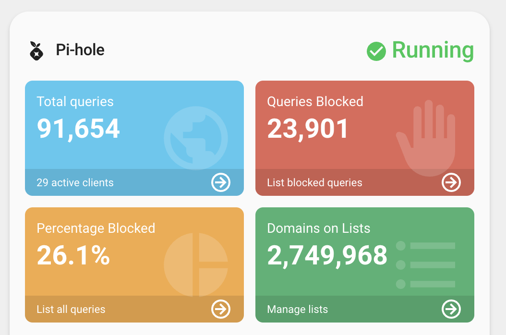

## Additional metrics

- Client statistics (active clients, unique domains, unique clients, etc.)
- Performance data (cached queries, forwarded requests)
- Optional actions per metric (tap/hold/double-tap)

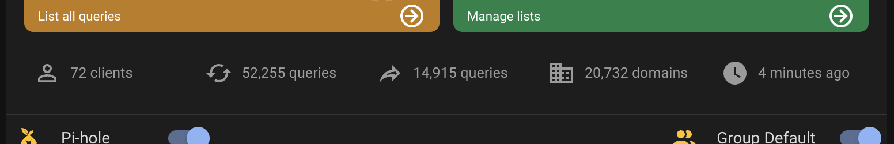

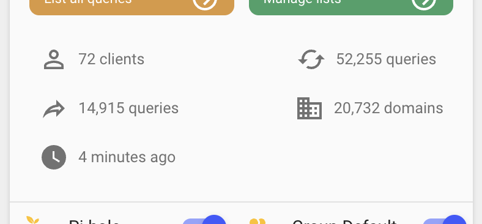

## System metrics chart

Visualize CPU and memory usage over time (typically 24h), using recorder history.

- Chart auto-loads statistics data from Home Assistant’s recorder
- Customizable line styles via `chart.line_type`

See [Chart configuration](configuration/CHART.md).

## Direct controls

- Enable/disable filtering (plus group default when available)
- Pause ad-blocking for a configured duration (supports multiple Pi-holes)
- Maintenance action buttons (restart DNS, update gravity, flush ARP/logs)
- Optional custom actions for the buttons

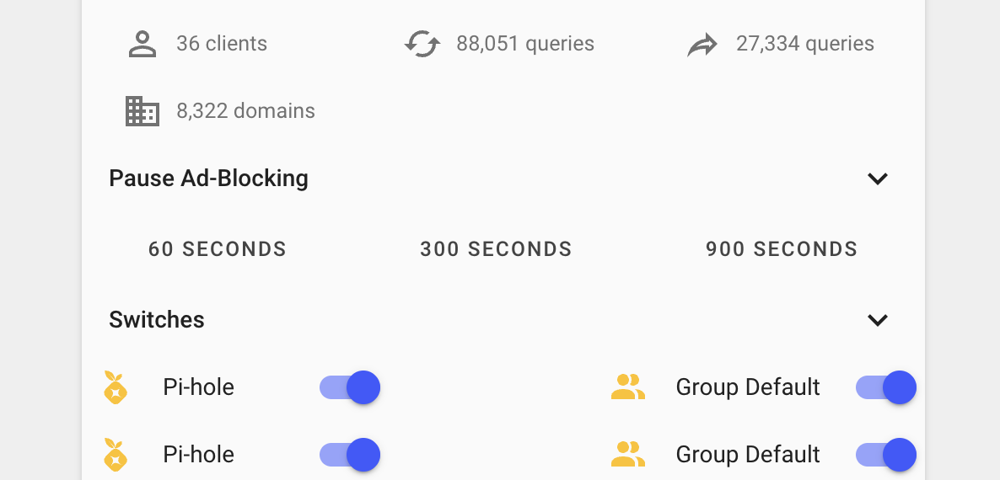

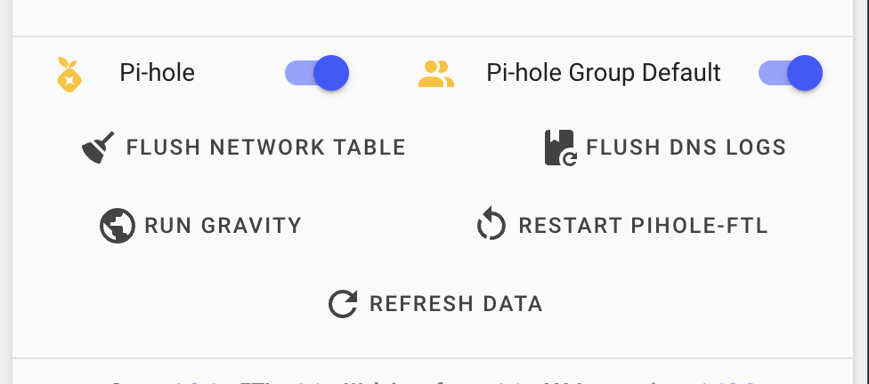

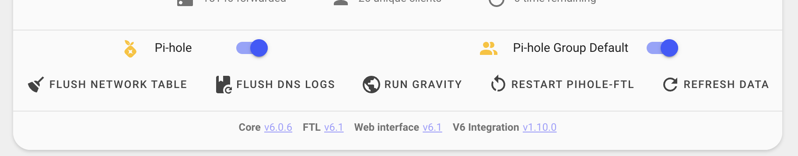

See [Pause configuration](configuration/PAUSE.md) and [Action configuration](configuration/ACTIONS.md).

## Version information

Shows installed and update versions for:

- Core
- Docker
- FTL
- Web interface
- Home Assistant integration

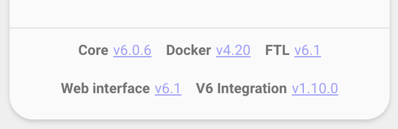

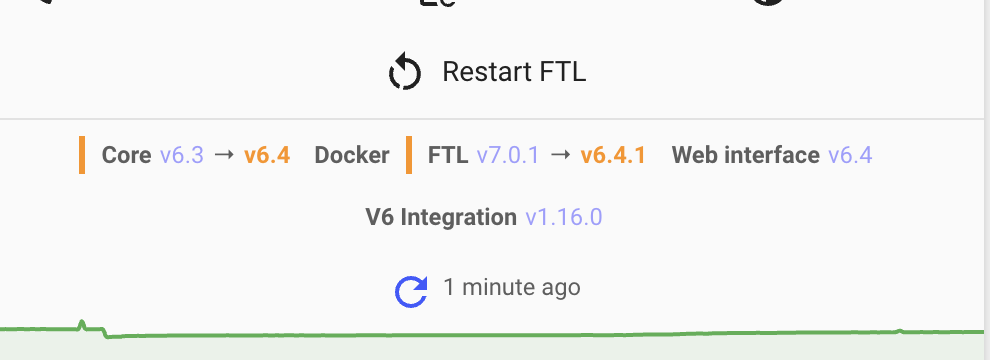

## Status monitoring

- Running/paused status and “time remaining” when paused
- Update indicators when updates are available
- Optional diagnostic message count and smart badge interactions

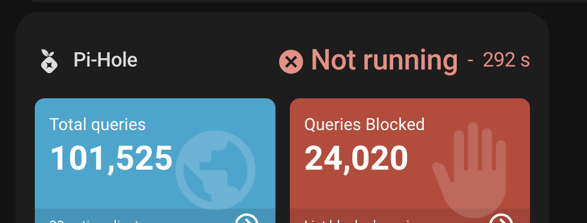

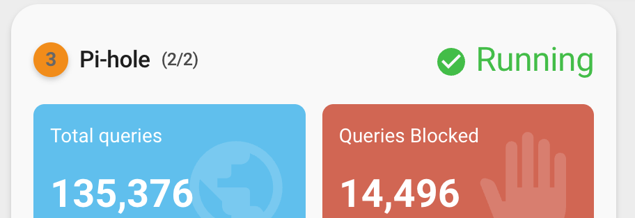

## Interactive dashboard

- Custom actions for stats/info/controls/badge
- Section filtering and collapsible sections

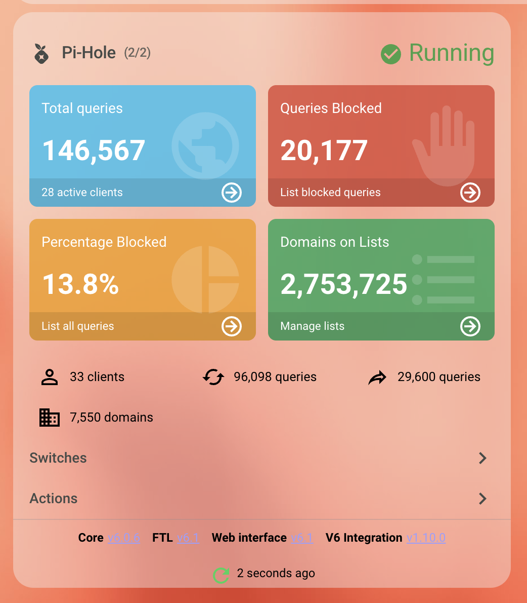

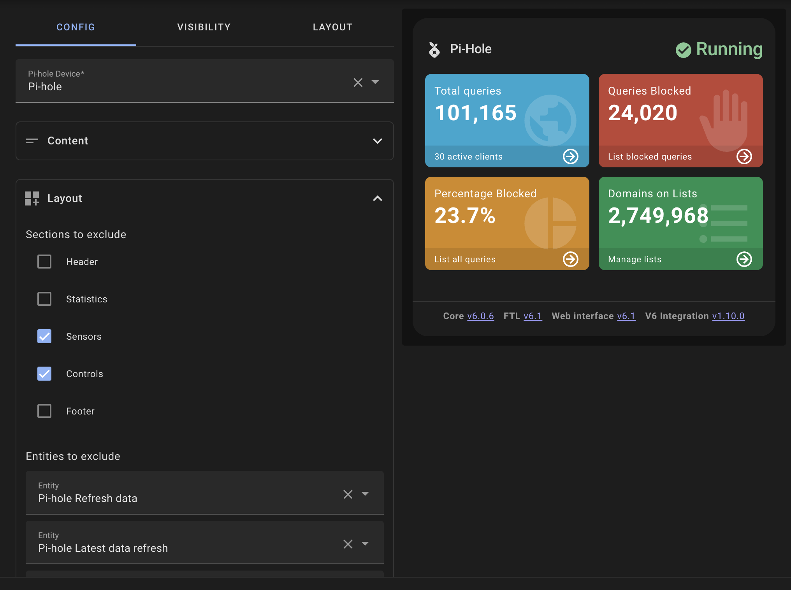

See [Sections, filtering, and ordering](configuration/SECTIONS.md).

## Multi Pi-hole support

Aggregates key stats and provides unified switches/controls.

See [Multi Pi-hole](MULTI-PIHOLE.md).

## Responsive layout

The card adapts to dashboard width on desktop and mobile.

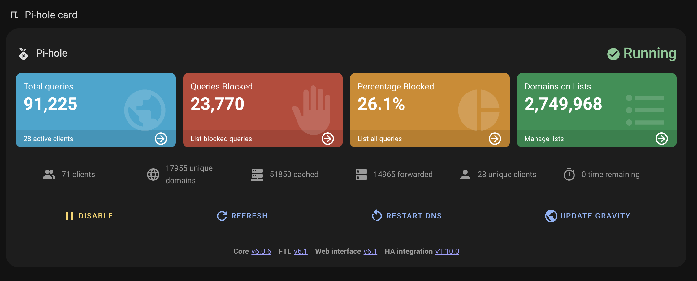

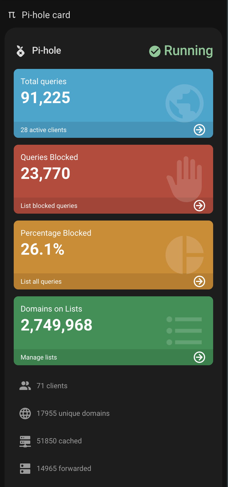
