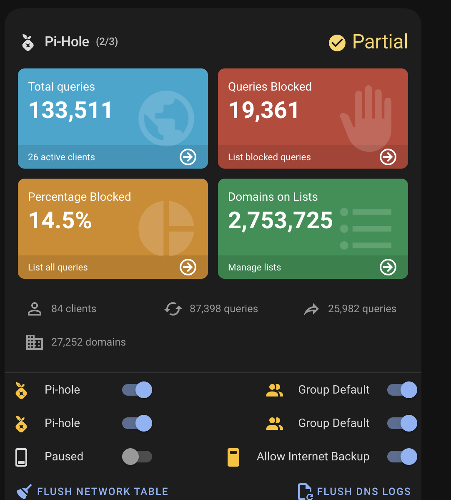
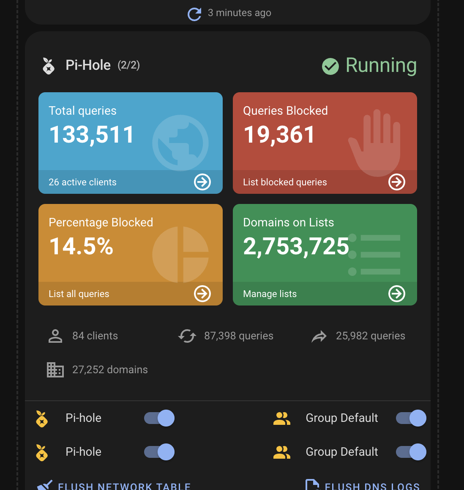

# Multi Pi-hole

Manage multiple Pi-hole instances from a single card.

## What gets combined

Dashboard statistics are automatically combined across all configured Pi-holes:

- **Total DNS Queries**: sum
- **Queries Blocked**: sum
- **Block Percentage**: recalculated from combined totals \((total_blocked / total_queries) × 100\)
- **Domains on Blocklists**: sum
- **Active Clients**: sum of unique clients across all instances (as exposed by the integration)

## What is shown from the “first” Pi-hole

Some sections show data from the first Pi-hole instance (for example, additional metrics and system charts), while switches/actions are shown for all instances.

## Status

Header status reflects the overall state:

- **Running** when all instances are active
- **Partial** when some instances are active and some are inactive (shows count like `2/3`)

Example (partial):

Example (all running):

> [!NOTE]
> With multiple Pi-hole instances, dashboard statistics are combined; switches from all instances appear in one list; header status reflects the combined state; some sections (e.g. additional metrics, system chart) may follow the **first** configured instance—see [Features](FEATURES.md).
