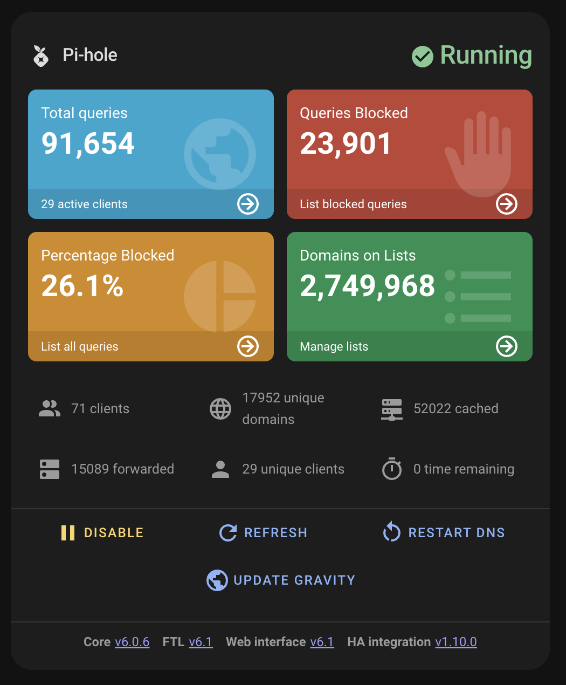

<p align="center">
  
</p>

# Pi-hole Card

Complete Pi-hole monitoring and control for Home Assistant.

## Quick Start

```yaml
type: custom:pi-hole
device_id: your_pihole_device_id
```

## What you get

- Dashboard-style statistics (queries, blocked, percent, domains on lists)
- One-click controls (enable/disable, pause, maintenance actions)
- Diagnostics and update indicators
- Optional system metrics chart (CPU/memory via recorder history)
- Multi-Pi-hole support (aggregated stats + unified controls)

## Next steps

- [Installation](INSTALLATION.md)
- [Configuration](CONFIGURATION.md)
- [Features](FEATURES.md)
- [Multi Pi-hole](MULTI-PIHOLE.md)
- [Troubleshooting](TROUBLESHOOTING.md)
